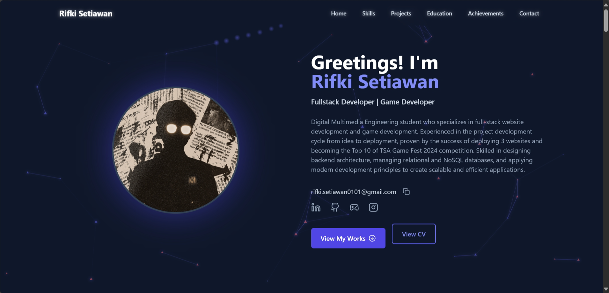
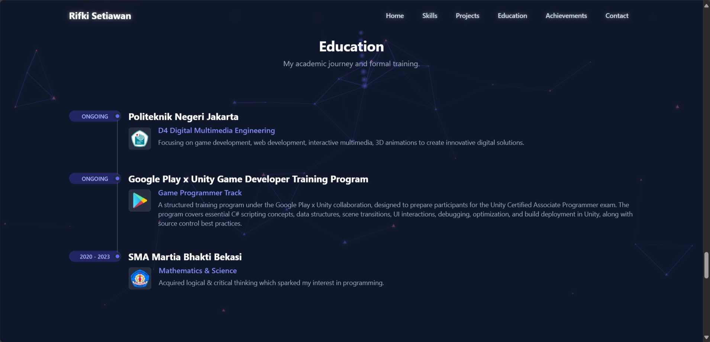
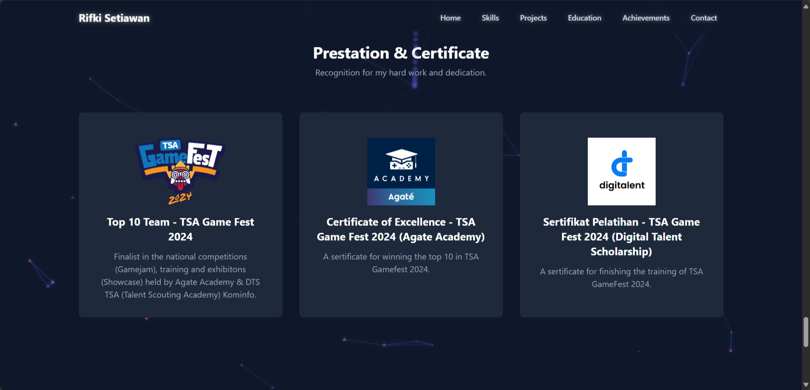
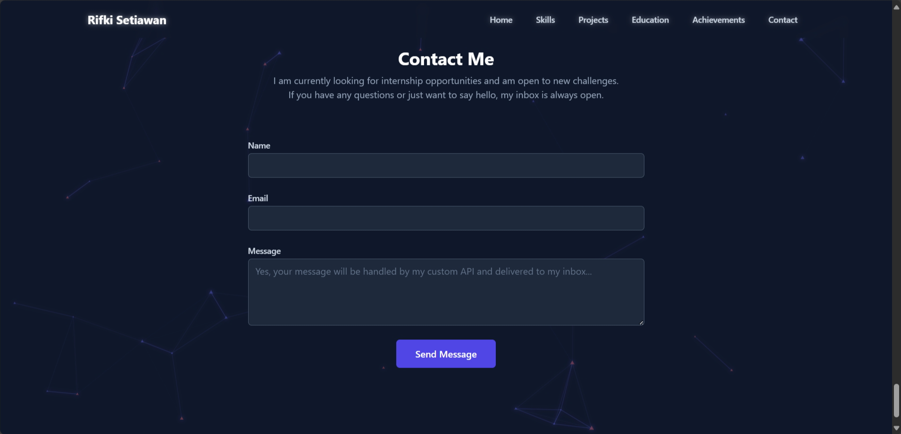

> **⚠️ Project Archived: This Portfolio Has Been Upgraded!**
>
> This repository contains the deprecated version of my portfolio, built with Create React App. For better performance, improved SEO, and a more modern architecture, this project has been completely migrated to **Next.js**.
>
> **➡️ [View the new Next.js version here: rstiawann-portfolio](https://github.com/rifkisetiawan0101/rstiawann-portfolio)**

# 🚀 Rifki Setiawan - Personal Portfolio Website 🚀

## ✨ Demo

You can view the live portfolio here: [**Portfolio**](https://rstiawann.vercel.app/) or copy the link: https://rstiawann.vercel.app/

## 📖 Overview

This is the official repository for my personal portfolio website. This project is more than just a digital resume; it's a full-stack application designed to showcase my skills in both frontend and backend development. Built as a dynamic Single Page Application (SPA), it features a modern, interactive user interface with complex animations and a custom-built backend to handle real-world functionalities like a contact form.

The entire application, including the backend API, is deployed seamlessly on Vercel, demonstrating a modern, integrated approach to web development.

## ⚙️ Features

This portfolio is packed with features that demonstrate a wide range of technical skills:

* **Dynamic & Interactive UI:**
    * **Particle Background:** An animated, interactive particle background built with `tsParticles` that responds to mouse movement.
    * **Custom Mouse Trail:** A subtle glowing trail follows the user's cursor, enhancing the user experience.
    * **Complex CSS Animations:** Implemented various custom animations (`@keyframes`) for buttons and UI elements to create a "living" interface.
    * **Smooth Transitions:** Utilizes CSS transitions for seamless show/hide effects on project galleries and the mobile navigation menu.

* **Custom Backend API:**
    * Built a custom, server-side API using **Vercel Serverless Functions** (Node.js environment) to handle incoming data from the contact form.
    * The API validates incoming data and orchestrates a multi-step process: saving to a database and triggering an email notification.

* **Full-Stack Functionality:**
    * **Database Integration:** Successfully connected to a **MongoDB Atlas** database, implementing a Mongoose schema to store contact form messages persistently.
    * **Third-Party API Integration:** Integrated the **Resend API** for reliable, automated email notifications, sending a message to my personal inbox whenever a new contact form is submitted.

* **Responsive Design:**
    * Fully responsive layout built with Tailwind CSS, ensuring a great user experience on all devices, from mobile phones to desktop screens.

## 💻 Technology Stack

This project leverages a modern, robust, and scalable technology stack.

**Frontend:**

**Backend:**

**Database & APIs:**

## 📸 Screenshots

**Home Section**

**Skills Section**

**Projects Section**

**Education Section**

**Achievements Section**

**Contact Section**

## 📄 License

This project is licensed under the Apache 2.0 License. See [LICENSE](LICENSE) for details.

## 🙏 Credits

**Rifki Setiawan** 👨‍💻 Full Stack Developer & Game Programmer ([GitHub](https://github.com/rifkisetiawan0101))

---

Thanks for visiting my project repository! ✨
